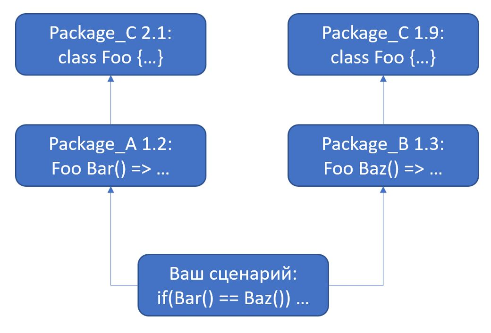

# Компонентное программирование

Строительные блоки программы:
* Подпрограммы
* Классы
* Библиотеки классов
  * Сборки в .NET
* Пакеты 
  * NuGet в .NET
* Компоненты COM (для Windows)
* Сервисы

*Компонент* — это элемент конструкции с определенным, зафиксированным в спецификации, интерфейсом и явными зависимостями от контекста. Компоненты могут распространяться независимо друг от друга и компоноваться третьей стороной. 

Пакет (package):
* Уникальное имя
* Версия
  * Часто используется semver: Major.Minor.Revision.Build
* Cодержимое
* Зависимости
  * Другие пакеты
  * Дополнительные действия при установке

Менеджер пакетов:
* Ищет пакет в репозитории
* Проверяет зависимости
* Скачивает на локальный диск
* Разворачивает

Конфликт версий пакета:

Ссылки:
[Семантические версии](https://semver.org/)
[CDC: Consumer Driven Contracts](https://martinfowler.com/articles/consumerDrivenContracts.html)