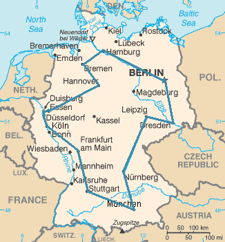
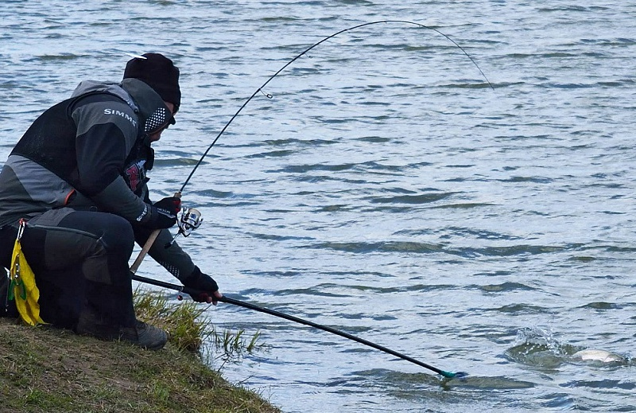
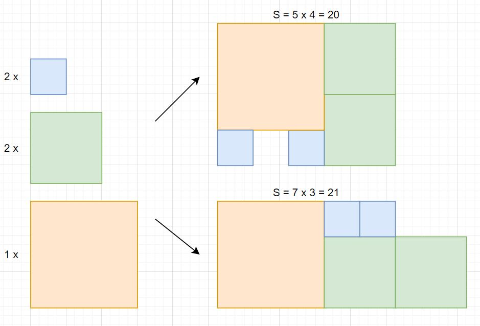

Вариант 1. Задача коммивояжера
------------------------------

Задана симметричная квадратная матрица расстояний между $N$ городами $D=\{d_{ij}\}\in R^{N \times N}; d_{ij}=d_{ji}>0; d_{ii}=0$. Требуется найти близкий к кратчайшему маршрут, проходящий по одному разу через все указанные города с возвратом в исходный город. 

Это оптимальный маршрут коммивояжёра через 14 крупнейших городов Германии. Указанный маршрут является самым коротким из всех возможных 43 589 145 600 вариантов.

В качестве множества решений задачи можно взять множество всех перестановок первых $N$ натуральных чисел. Каждый экземпляр решения определяет порядок посещения городов. Более приспособленным является экземпляр с меньшей длиной маршрута. Мутация - перестановка двух элементов экземпляра.

Вариант 2. Расписание турнира
-----------------------------

$N$ участников играют парные матчи в $R$ турах на $K$ площадках. Можно считать, что $1 \leq R \lt N \leq K$. Требуется составить расписание турнира в котором:
* Каждый участник играет с максимальным количество соперников.
* Каждый участник посещает максимальное количество разных площадок.
* В одном туре на одной площадке может быть сыгран только один матч.

В качестве экземпляра множества решений можно взять матрицу $S=\{s_{rn}\}\in \R^{R\times N}; s_{rn}\in\{1,2,...,K\}$. Элемент матрицы $s_{rn}$ - это номер площадки на которой в туре $r$ играет участник $n$.

Из двух расписаний лучшим (более приспособленным) считается то, в котором больше мининимальное для всех участников количество соперников. Если минимальное количество соперников одинаковое, то лучшим считается расписание, в котором больше минимальное для всех участников количество посещённых площадок.  

Вариант 3. Двумерная упаковка
-----------------------------

Необходимо максимально компактно расположить на плоскости заданное количество квадратов со сторонами $1, 2$ и $3$. Сильные духом могут решить задачу для прямоугольников 7 размеров: $1 \times 1, 1 \times 2, 2 \times 1, 2 \times 2, 1 \times 3, 3 \times 1, 3 \times 3$. 
* Фигуры не пересекаются.
* Стороны паралелльны. 
* Повороты прямоугольников запрещены.

В качестве экземпляра решения в задаче для $N$ фигур можно взять векторы $x\in R^N$ и $y\in R^N$ c целочисленными координатами левой нижней вершины каждой фигуры.

Метрикой компактности является площадь ограничивающего все фигуры прямоугольника.

